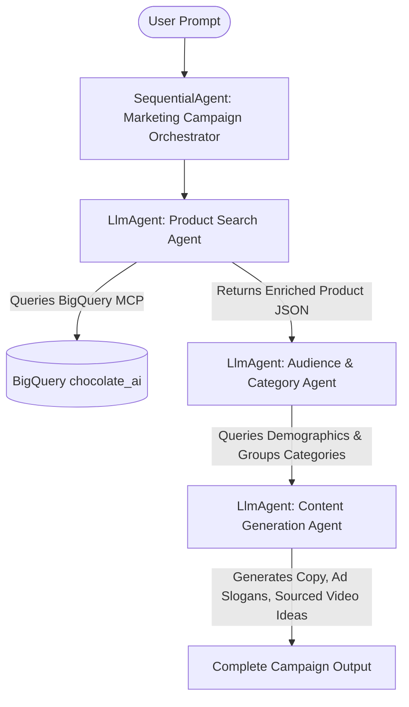

# Marketing Campaign Agent: Architecture & Deployment Guide

This agent is a multi-agent workflow designed to generate end-to-end marketing campaign creative content. It uses **Google ADK (Agent Development Kit)** to orchestrate specialized agents and is optimized for deployment to the **Vertex AI Agent Engine (Agent Runtime)**.

> [!WARNING]
> Before deploying or running the agent, you MUST replace all placeholder values (such as `<PROJECT-ID>` and `<PROJECT-NUMBER>`) with your own Google Cloud project configuration.

---

## 🏗️ Architecture Overview

The system utilizes a sequential routing design where each agent executes its specialty in turn, handing off structured context to the next agent:



### Specialized Agents
1. **Product Search Agent**: Integrates with a BigQuery Model Context Protocol (MCP) server to query and enrich the product catalog in the `chocolate_ai` dataset.
2. **Audience Agent**: Identifies target demographics and product categories using both direct BigQuery insights and Gemini reasoning.
3. **Content Generation Agent**: Synthesizes the product details and audience profile to write ad copy, slogans, and suggest video content.
4. **Sequential Agent (Orchestrator)**: Acts as the router, coordinating the execution sequence and flow of information.

---

## 🛠️ Configuration & Environment Setup

All runtime and credentials configuration is loaded via environment variables in the `.env` file:

```bash
# General config
GOOGLE_GENAI_USE_VERTEXAI=1
GOOGLE_CLOUD_PROJECT=<PROJECT-ID>

# Regional routing separation
GOOGLE_CLOUD_LOCATION=global             # Where models are called from
GOOGLE_CLOUD_LOCATION_RUN=us-central1     # Where platform sessions and Memory Services run

# OpenTelemetry & Observability configuration
GOOGLE_CLOUD_AGENT_ENGINE_ENABLE_TELEMETRY=true
OTEL_INSTRUMENTATION_GENAI_CAPTURE_MESSAGE_CONTENT=true
OTEL_SEMCONV_STABILITY_OPT_IN='gen_ai_latest_experimental'
```

---

## 🏛️ Integration with Agent Platform Session & Memory Bank

To persist interaction state and utilize semantic memory banks in production, the root orchestrator agent is wrapped inside an `AdkApp` structure in [agent.py](file:///Users/raniamoh/my-playground/ai-live-demos/ai-live-agent-platform-demo/agentic-ai/market_campaign_wf/campaign_agent/agent.py):

* **Platform Session Service (`VertexAiSessionService`)**: Maintains state and event history for each user session.
* **Memory Bank Service (`VertexAiMemoryBankService`)**: Allows agents to recall past user interactions across sessions.
* **Cloud Trace (`enable_tracing=True`)**: Captures detailed trace spans for agent activities, tool executions, and LLM calls in Cloud Trace.

---

## 🚀 How to Deploy on Agent Engine

To deploy the agent to the Vertex AI Agent Engine platform:

1. Ensure you have authenticated using the Google Cloud SDK:
   ```bash
   gcloud auth login
   gcloud auth application-default login
   ```

2. Run the ADK deployment command specifying the `app` wrapper object:
   ```bash
   adk deploy agent_engine \
     --project <PROJECT-ID> \
     --region us-central1 \
     --display_name "marketing_campaign_agent" \
     --adk_app_object app \
     agentic-ai/market_campaign_wf/campaign_agent
   ```

3. When successful, the deployment will print your **Reasoning Engine Resource ID** (e.g. `projects/<PROJECT-NUMBER>/locations/us-central1/reasoningEngines/<ENGINE-ID>`).

---

## 🧪 Testing the Deployed Agent

### Using curl

To execute a streaming query against the deployed endpoint, run:

```bash
curl -N -X POST \
  -H "Authorization: Bearer $(gcloud auth print-access-token)" \
  -H "Content-Type: application/json" \
  "https://us-central1-aiplatform.googleapis.com/v1/projects/<PROJECT-ID>/locations/us-central1/reasoningEngines/<ENGINE-ID>:streamQuery?alt=sse" \
  -d '{
    "input": {
      "message": "hi help me with the campaign for Parisian Chocolate Easter Egg",
      "user_id": "user_123"
    }
  }'
```

*Note: Be sure to wrap the URL in quotes to escape the `\` character in shells like `zsh`.*

### Using Python SDK

```python
import vertexai
from vertexai.preview import reasoning_engines

vertexai.init(
    project="<PROJECT-ID>",
    location="us-central1"
)

# Load the deployed engine
agent = reasoning_engines.ReasoningEngine(
    "projects/<PROJECT-NUMBER>/locations/us-central1/reasoningEngines/<ENGINE-ID>"
)

# Execute streaming query
for event in agent.stream_query(
    message="hi help me with the campaign for Parisian Chocolate Easter Egg",
    user_id="user_123"
):
    print(event)
```

---

## 💻 Running & Testing Locally

To test agent execution on your local development machine:

1. Create a virtual environment and install dependencies:
   ```bash
   python3 -m venv .venv
   source .venv/bin/activate
   pip install -r requirements.txt
   ```

2. Authenticate to Google Cloud and BigQuery:
   ```bash
   gcloud auth application-default login
   ```

3. **Option A: Run Local Web UI (ADK Web)**
   ADK provides a built-in FastAPI web playground for testing your agents locally.
   
   To start the web server using local/in-memory session storage:
   ```bash
   adk web agentic-ai/market_campaign_wf
   ```
   *Then open your browser at `http://127.0.0.1:8000` to interact with the agent.*

4. **Option B: Run Local Web UI connected to Deployed Runtime Sessions**
   If you want to run the web UI locally but keep session data and memory bank records synced with a deployed production agent runtime ID:
   ```bash
   adk web \
     --session_service_uri="agentengine://<ENGINE-ID>" \
     --memory_service_uri="agentengine://<ENGINE-ID>" \
     agentic-ai/market_campaign_wf
   ```

5. **Option C: Run via Python Script**
   Create a `run_local.py` file and execute it:
   ```python
   # run_local.py
   from agent import root_agent
   from google.adk import Runner
   from google.adk.sessions import InMemorySessionService
   from google.adk.memory import InMemoryMemoryService

   runner = Runner(
       agent=root_agent,
       app_name="marketing_campaign_agent",
       session_service=InMemorySessionService(),
       memory_service=InMemoryMemoryService()
   )

   response = runner.run(
       user_id="local_user",
       session_id="local_session_1",
       new_message="hi help me with the campaign for Parisian Chocolate Easter Egg"
   )

   for event in response:
       print(event)
   ```
